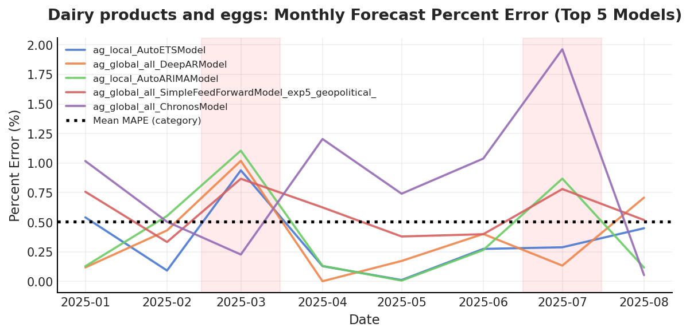
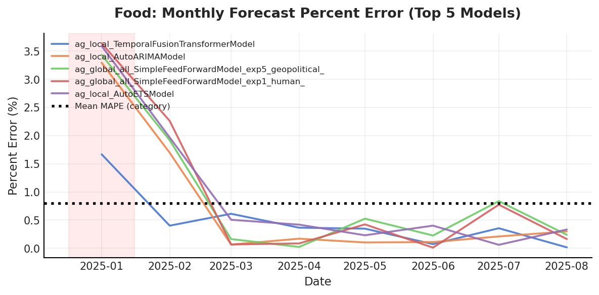
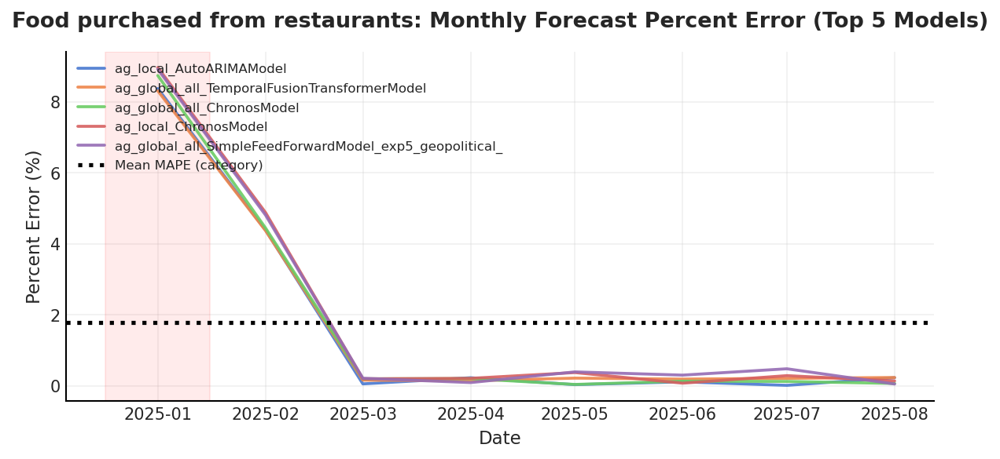
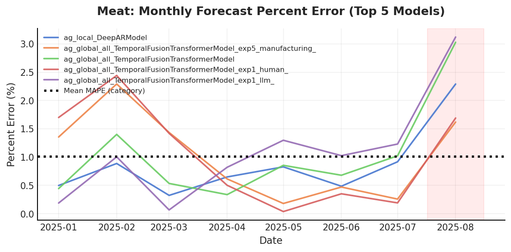
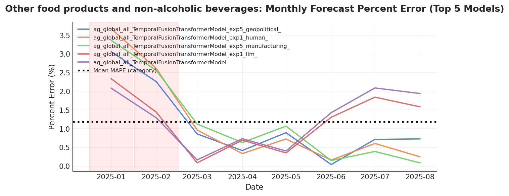
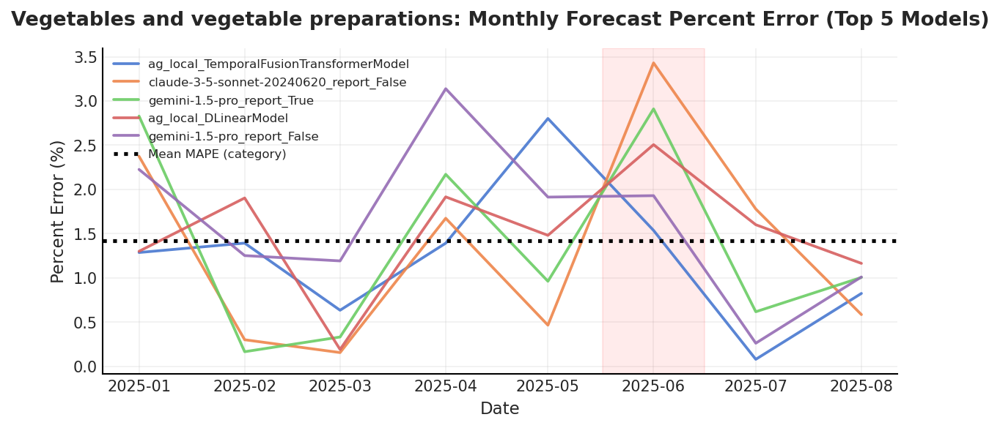

# 📊 CFPR 2025 Forecast Evaluation Report
**Generated:** October 21, 2025

This report summarizes model performance across **monthly (MAPE)**, **year-over-year (YoY)**, and **cross-metric** evaluations for all food categories.

---

## 🍎 Category-Level Evaluations

### Bakery and cereal products (excluding baby food)

**Top 10 Models (MAPE + YoY Residual)**

|                                                                            |   MAPE (%) |   YoY Residual (%) |
|:---------------------------------------------------------------------------|-----------:|-------------------:|
| gemini-1.5-pro_report_False                                                |       0.42 |              -0.15 |
| gemini-1.5-pro_report_True                                                 |       0.44 |              -0.02 |
| claude-3-5-sonnet-20240620_report_False                                    |       0.53 |               0.05 |
| claude-3-5-sonnet-20240620_report_True                                     |       0.53 |               0.08 |
| gpt-4o_report_True                                                         |       0.54 |              -0.22 |
| ag_global_cpi_with_covariates_TemporalFusionTransformerModel_exp5_climate_ |       0.58 |              -0.44 |
| ag_local_NaiveModel                                                        |       0.6  |              -0.46 |
| gpt-4o_report_False                                                        |       0.6  |               0.19 |
| ag_local_ChronosModel                                                      |       0.76 |              -0.24 |
| ag_local_TemporalFusionTransformerModel                                    |       0.86 |               0.35 |

**Monthly Percent Error Trends (Top 5 Models)**

_percent_error_dynamic.png)

**Recommended Models:** gemini-1.5-pro_report_True, claude-3-5-sonnet-20240620_report_False, gemini-1.5-pro_report_False

---

### Dairy products and eggs

**Top 10 Models (MAPE + YoY Residual)**

|                                                                                  |   MAPE (%) |   YoY Residual (%) |
|:---------------------------------------------------------------------------------|-----------:|-------------------:|
| ag_local_AutoETSModel                                                            |       0.34 |              -0.05 |
| ag_global_all_DeepARModel                                                        |       0.37 |              -0.29 |
| ag_local_AutoARIMAModel                                                          |       0.4  |               0.1  |
| ag_global_all_SimpleFeedForwardModel_exp5_geopolitical_                          |       0.58 |               0.52 |
| ag_global_all_ChronosModel                                                       |       0.84 |               0.86 |
| ag_global_all_SimpleFeedForwardModel_exp1_human_                                 |       0.85 |               0.93 |
| ag_local_PatchTSTModel                                                           |       0.98 |               1.11 |
| ag_local_SimpleFeedForwardModel                                                  |       1.2  |               1.35 |
| ag_global_cpi_with_covariates_TemporalFusionTransformerModel_exp5_manufacturing_ |       1.28 |               0.28 |
| ag_local_DLinearModel                                                            |       1.92 |               0.82 |

**Monthly Percent Error Trends (Top 5 Models)**

**Recommended Models:** ag_local_AutoETSModel, ag_local_AutoARIMAModel, ag_global_all_DeepARModel

---

### Fish, seafood and other marine products

**Top 10 Models (MAPE + YoY Residual)**

|                                                                  |   MAPE (%) |   YoY Residual (%) |
|:-----------------------------------------------------------------|-----------:|-------------------:|
| ag_local_DeepARModel                                             |       0.41 |              -0.08 |
| ag_local_ChronosModel                                            |       0.5  |              -0.09 |
| ag_global_all_TemporalFusionTransformerModel_exp5_geopolitical_  |       0.62 |              -0.35 |
| ag_global_all_DeepARModel_exp1_llm_                              |       0.64 |              -0.34 |
| ag_global_all_TemporalFusionTransformerModel                     |       0.67 |              -0.36 |
| ag_global_all_TemporalFusionTransformerModel_exp5_manufacturing_ |       0.73 |               0.22 |
| ag_global_all_SimpleFeedForwardModel_exp5_geopolitical_          |       0.82 |              -0.31 |
| ag_local_AutoETSModel                                            |       0.86 |              -0.57 |
| ag_global_all_SimpleFeedForwardModel_exp1_human_                 |       0.93 |               0.61 |
| ag_local_DLinearModel                                            |       1.48 |              -0.08 |

**Recommended Models:** ag_local_DeepARModel, ag_local_ChronosModel, ag_global_all_DeepARModel_exp1_llm_

---

### Food

**Top 10 Models (MAPE + YoY Residual)**

|                                                         |   MAPE (%) |   YoY Residual (%) |
|:--------------------------------------------------------|-----------:|-------------------:|
| ag_local_TemporalFusionTransformerModel                 |       0.48 |               0.25 |
| ag_local_AutoARIMAModel                                 |       0.74 |               0.6  |
| ag_global_all_SimpleFeedForwardModel_exp5_geopolitical_ |       0.92 |               0.57 |
| ag_global_all_SimpleFeedForwardModel_exp1_human_        |       0.93 |               0.8  |
| ag_local_AutoETSModel                                   |       0.94 |               1.08 |
| ag_global_all_TemporalFusionTransformerModel            |       0.96 |               1.11 |
| ag_global_all_ChronosModel                              |       1.32 |              -0.46 |
| ag_global_all_DeepARModel                               |       1.51 |              -0.86 |
| ag_local_DLinearModel                                   |       1.53 |              -0.65 |
| ag_local_ChronosModel                                   |       1.67 |              -0.85 |

**Monthly Percent Error Trends (Top 5 Models)**

**Recommended Models:** ag_local_TemporalFusionTransformerModel, ag_global_all_SimpleFeedForwardModel_exp5_geopolitical_, ag_local_AutoARIMAModel

---

### Food purchased from restaurants

**Top 10 Models (MAPE + YoY Residual)**

|                                                                                  |   MAPE (%) |   YoY Residual (%) |
|:---------------------------------------------------------------------------------|-----------:|-------------------:|
| ag_global_all_SimpleFeedForwardModel_exp5_geopolitical_                          |       1.91 |               1.59 |
| ag_global_all_DeepARModel                                                        |       2.46 |               0    |
| ag_local_DLinearModel                                                            |       2.61 |               0.89 |
| ag_global_cpi_with_covariates_TemporalFusionTransformerModel_exp5_manufacturing_ |       2.79 |              -1.48 |
| ag_global_all_DeepARModel_exp1_human_                                            |       2.87 |              -1.63 |
| ag_local_DeepARModel                                                             |       3    |              -0.61 |
| ag_global_all_DeepARModel_exp5_climate_                                          |       3.02 |              -1.41 |
| ag_local_NaiveModel                                                              |       3.32 |              -1.13 |
| ag_global_all_DLinearModel                                                       |       3.81 |              -1.49 |
| ag_global_cpi_with_covariates_TemporalFusionTransformerModel_exp1_human_         |       3.88 |              -0.59 |

**Monthly Percent Error Trends (Top 5 Models)**

**Recommended Models:** ag_global_all_DeepARModel, ag_local_DLinearModel, ag_local_DeepARModel

---

### Fruit, fruit preparations and nuts

**Top 10 Models (MAPE + YoY Residual)**

|                                                                                  |   MAPE (%) |   YoY Residual (%) |
|:---------------------------------------------------------------------------------|-----------:|-------------------:|
| ag_local_TemporalFusionTransformerModel                                          |       0.64 |               0.04 |
| ag_global_all_SimpleFeedForwardModel_exp1_llm_                                   |       0.72 |               0.25 |
| ag_global_all_SimpleFeedForwardModel                                             |       0.73 |              -0.23 |
| ag_global_all_SimpleFeedForwardModel_exp5_climate_                               |       0.93 |              -0.22 |
| ag_global_all_SimpleFeedForwardModel_exp5_manufacturing_                         |       0.94 |               1.04 |
| ag_global_all_TemporalFusionTransformerModel_exp5_manufacturing_                 |       1.41 |              -0.91 |
| ag_global_all_DeepARModel                                                        |       1.64 |              -1.68 |
| ag_global_all_TemporalFusionTransformerModel_exp5_climate_                       |       1.76 |              -1.39 |
| ag_global_cpi_with_covariates_TemporalFusionTransformerModel_exp5_manufacturing_ |       1.78 |              -0.39 |
| ag_global_all_PatchTSTModel                                                      |       2.21 |               1.14 |

**Recommended Models:** ag_local_TemporalFusionTransformerModel, ag_global_all_SimpleFeedForwardModel, ag_global_all_SimpleFeedForwardModel_exp1_llm_

---

### Meat

**Top 10 Models (MAPE + YoY Residual)**

|                                                    |   MAPE (%) |   YoY Residual (%) |
|:---------------------------------------------------|-----------:|-------------------:|
| ag_local_DeepARModel                               |       0.86 |              -0.27 |
| ag_global_all_TemporalFusionTransformerModel       |       1.04 |              -0.35 |
| claude-3-5-sonnet-20240620_report_False            |       1.18 |              -0.2  |
| ag_local_SimpleFeedForwardModel                    |       1.37 |              -0.26 |
| ag_local_AutoETSModel                              |       1.39 |              -0.59 |
| ag_global_all_SimpleFeedForwardModel               |       1.4  |               0.4  |
| ag_global_all_ChronosModel                         |       1.46 |              -0.19 |
| ag_global_all_SimpleFeedForwardModel_exp5_climate_ |       1.81 |              -0.14 |
| ag_local_ChronosModel                              |       1.82 |              -0.66 |
| ag_global_all_PatchTSTModel                        |       2.73 |              -0.12 |

**Monthly Percent Error Trends (Top 5 Models)**

**Recommended Models:** ag_local_DeepARModel, claude-3-5-sonnet-20240620_report_False, ag_global_all_TemporalFusionTransformerModel

---

### Other food products and non-alcoholic beverages

**Top 10 Models (MAPE + YoY Residual)**

|                                                                 |   MAPE (%) |   YoY Residual (%) |
|:----------------------------------------------------------------|-----------:|-------------------:|
| ag_global_all_TemporalFusionTransformerModel_exp5_geopolitical_ |       1.12 |               0.89 |
| ag_global_all_TemporalFusionTransformerModel_exp1_llm_          |       1.21 |              -0.11 |
| ag_global_all_TemporalFusionTransformerModel                    |       1.27 |              -0.31 |
| ag_local_AutoETSModel                                           |       1.44 |               0.17 |
| ag_global_all_SimpleFeedForwardModel                            |       1.72 |               0.7  |
| ag_global_all_SimpleFeedForwardModel_exp5_climate_              |       1.94 |               0.42 |
| ag_global_all_SimpleFeedForwardModel_exp1_llm_                  |       1.94 |               1.13 |
| ag_global_all_SimpleFeedForwardModel_exp5_geopolitical_         |       2.01 |              -0.81 |
| ag_global_all_SimpleFeedForwardModel_exp1_human_                |       2.02 |              -0.71 |
| ag_global_all_PatchTSTModel                                     |       3.12 |              -0.55 |

**Monthly Percent Error Trends (Top 5 Models)**

**Recommended Models:** ag_global_all_TemporalFusionTransformerModel_exp1_llm_, ag_global_all_TemporalFusionTransformerModel, ag_local_AutoETSModel

---

### Vegetables and vegetable preparations

**Top 10 Models (MAPE + YoY Residual)**

|                                                                                  |   MAPE (%) |   YoY Residual (%) |
|:---------------------------------------------------------------------------------|-----------:|-------------------:|
| ag_local_TemporalFusionTransformerModel                                          |       1.24 |              -0.87 |
| claude-3-5-sonnet-20240620_report_False                                          |       1.35 |              -0.28 |
| ag_local_DLinearModel                                                            |       1.51 |              -0.55 |
| ag_local_AutoETSModel                                                            |       1.66 |              -0.94 |
| claude-3-5-sonnet-20240620_report_True                                           |       1.76 |               0.82 |
| ag_global_all_DLinearModel                                                       |       1.76 |               0.17 |
| ag_global_cpi_with_covariates_TemporalFusionTransformerModel_exp1_human_         |       1.77 |               0.6  |
| ag_local_DeepARModel                                                             |       2.01 |               0.99 |
| ag_global_all_DeepARModel                                                        |       2.03 |               0.38 |
| ag_global_cpi_with_covariates_TemporalFusionTransformerModel_exp5_manufacturing_ |       2.88 |              -0.36 |

**Monthly Percent Error Trends (Top 5 Models)**

**Recommended Models:** claude-3-5-sonnet-20240620_report_False, ag_global_all_DLinearModel, ag_local_DLinearModel

---

## 🌐 Overall Model Performance Summary

### Global Ranking (Combined MAPE + YoY Residual)

| model                                                           |   MAPE |   YoY_Residual |   Rank_Mean |
|:----------------------------------------------------------------|-------:|---------------:|------------:|
| gemini-1.5-pro_report_True                                      |  0.444 |          0.017 |       1.5   |
| ag_global_all_TemporalFusionTransformerModel_exp1_llm_          |  1.205 |          0.114 |       1.5   |
| gemini-1.5-pro_report_False                                     |  0.425 |          0.152 |       2.5   |
| claude-3-5-sonnet-20240620_report_False                         |  1.018 |          0.175 |       2.667 |
| ag_local_AutoARIMAModel                                         |  0.57  |          0.35  |       2.75  |
| ag_local_TemporalFusionTransformerModel                         |  0.804 |          0.377 |       3.875 |
| ag_global_all_SimpleFeedForwardModel_exp5_climate_              |  1.559 |          0.26  |       4.333 |
| ag_local_DeepARModel                                            |  1.569 |          0.487 |       4.625 |
| claude-3-5-sonnet-20240620_report_True                          |  1.147 |          0.453 |       4.75  |
| ag_global_all_DeepARModel_exp1_llm_                             |  0.636 |          0.335 |       5     |
| ag_global_all_TemporalFusionTransformerModel_exp5_geopolitical_ |  0.87  |          0.624 |       5     |
| ag_global_all_ChronosModel                                      |  1.21  |          0.502 |       5.167 |
| ag_global_all_SimpleFeedForwardModel                            |  1.287 |          0.442 |       5.167 |
| ag_global_all_SimpleFeedForwardModel_exp5_geopolitical_         |  1.249 |          0.761 |       5.3   |
| ag_local_AutoETSModel                                           |  1.105 |          0.567 |       5.5   |

### Model Coverage (Number of Categories where Top-3)

| model                                        |   Top3 |
|:---------------------------------------------|-------:|
| ag_local_DeepARModel                         |      3 |
| claude-3-5-sonnet-20240620_report_False      |      3 |
| ag_local_DLinearModel                        |      2 |
| ag_local_AutoETSModel                        |      2 |
| ag_local_AutoARIMAModel                      |      2 |
| ag_local_TemporalFusionTransformerModel      |      2 |
| ag_global_all_TemporalFusionTransformerModel |      2 |
| ag_global_all_DeepARModel                    |      2 |
| ag_global_all_SimpleFeedForwardModel         |      1 |
| gemini-1.5-pro_report_True                   |      1 |

### 🧠 Recommended Core Models (Across All Food Categories)

- gemini-1.5-pro_report_True
- ag_global_all_TemporalFusionTransformerModel_exp1_llm_
- gemini-1.5-pro_report_False
- claude-3-5-sonnet-20240620_report_False
- ag_local_AutoARIMAModel

