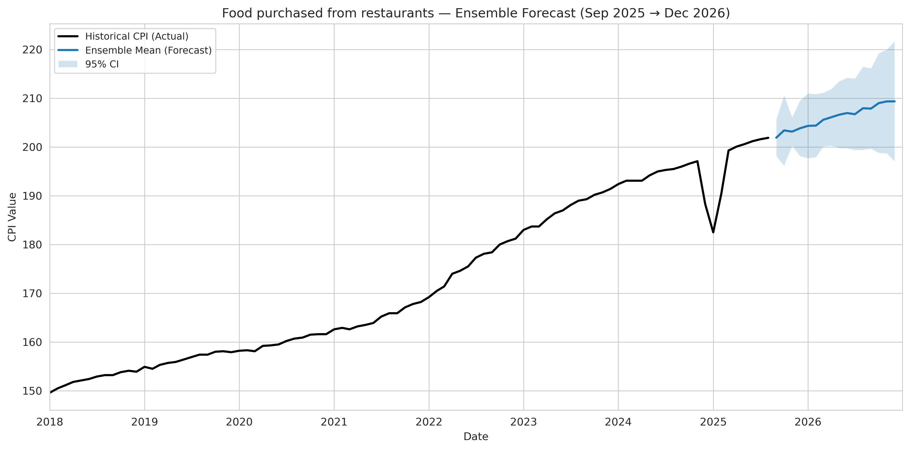

# 📊 CFPR 2026 Forecast Report (Per Category)
**Generated:** October 23, 2025

This report summarizes per-category 2026 forecasts, including:
- An **ensemble** (mean across models) with **95% confidence bands**
- An **all-models** plot (median & 90% CI where available)
- Tables for **per-model** and **ensemble** YoY estimates (Jan–Sep 2026 vs Jan–Sep 2025)

---

## Bakery and cereal products (excluding baby food)

**Ensemble YoY (Jan–Sep):**

| Category                                         |   Mean 2025 CPI (Jan–Sep) |   Ensemble 2026 CPI (Jan–Sep) |   Predicted YoY % Change (mean) |   Predicted YoY % Change (±1σ) | Predicted YoY % Range (mean ± 1σ)   |
|:-------------------------------------------------|--------------------------:|------------------------------:|--------------------------------:|-------------------------------:|:------------------------------------|
| Bakery and cereal products (excluding baby food) |                     199.1 |                        205.43 |                            3.18 |                           0.65 | 2.53 to 3.83                        |

**All Models (YoY based on medians, Jan–Sep):**

| Model                               |   Mean 2025 CPI (Jan–Sep) |   Predicted 2026 CPI (Jan–Sep) |   Predicted YoY % Change |
|:------------------------------------|--------------------------:|-------------------------------:|-------------------------:|
| ARIMA                               |                     199.1 |                         204.91 |                     2.92 |
| AutoETS                             |                     199.1 |                         201.67 |                     1.29 |
| CovariatesDeepAR                    |                     199.1 |                         201.22 |                     1.06 |
| CovariatesTemporalFusionTransformer |                     199.1 |                         208.39 |                     4.66 |
| DeepAR                              |                     199.1 |                         202.18 |                     1.55 |
| SimpleFeedForward                   |                     199.1 |                         200.24 |                     0.57 |
| TemporalFusionTransformer           |                     199.1 |                         211.56 |                     6.26 |
| WeightedEnsemble                    |                     199.1 |                         213.28 |                     7.12 |

**Ensemble Forecast (with 95% CI)**

_ensemble.png)

**All Models (Median & 90% CI)**

_all_models.png)

---

## Dairy products and eggs

**Ensemble YoY (Jan–Sep):**

| Category                |   Mean 2025 CPI (Jan–Sep) |   Ensemble 2026 CPI (Jan–Sep) |   Predicted YoY % Change (mean) |   Predicted YoY % Change (±1σ) | Predicted YoY % Range (mean ± 1σ)   |
|:------------------------|--------------------------:|------------------------------:|--------------------------------:|-------------------------------:|:------------------------------------|
| Dairy products and eggs |                     176.4 |                        181.31 |                            2.79 |                            0.4 | 2.39 to 3.18                        |

**All Models (YoY based on medians, Jan–Sep):**

| Model                               |   Mean 2025 CPI (Jan–Sep) |   Predicted 2026 CPI (Jan–Sep) |   Predicted YoY % Change |
|:------------------------------------|--------------------------:|-------------------------------:|-------------------------:|
| ARIMA                               |                     176.4 |                         181.85 |                     3.09 |
| AutoETS                             |                     176.4 |                         179.39 |                     1.7  |
| CovariatesDeepAR                    |                     176.4 |                         178.36 |                     1.11 |
| CovariatesTemporalFusionTransformer |                     176.4 |                         186.04 |                     5.47 |
| DeepAR                              |                     176.4 |                         182    |                     3.18 |
| SimpleFeedForward                   |                     176.4 |                         181.66 |                     2.98 |
| TemporalFusionTransformer           |                     176.4 |                         177.42 |                     0.58 |
| WeightedEnsemble                    |                     176.4 |                         183.77 |                     4.18 |

**Ensemble Forecast (with 95% CI)**

**All Models (Median & 90% CI)**

---

## Fish, seafood and other marine products

**Ensemble YoY (Jan–Sep):**

| Category                                |   Mean 2025 CPI (Jan–Sep) |   Ensemble 2026 CPI (Jan–Sep) |   Predicted YoY % Change (mean) |   Predicted YoY % Change (±1σ) | Predicted YoY % Range (mean ± 1σ)   |
|:----------------------------------------|--------------------------:|------------------------------:|--------------------------------:|-------------------------------:|:------------------------------------|
| Fish, seafood and other marine products |                    165.16 |                         167.5 |                            1.41 |                           0.49 | 0.93 to 1.9                         |

**All Models (YoY based on medians, Jan–Sep):**

| Model                               |   Mean 2025 CPI (Jan–Sep) |   Predicted 2026 CPI (Jan–Sep) |   Predicted YoY % Change |
|:------------------------------------|--------------------------:|-------------------------------:|-------------------------:|
| ARIMA                               |                    165.16 |                         167.41 |                     1.36 |
| AutoETS                             |                    165.16 |                         168.42 |                     1.97 |
| CovariatesDeepAR                    |                    165.16 |                         167.75 |                     1.57 |
| CovariatesTemporalFusionTransformer |                    165.16 |                         165.95 |                     0.48 |
| DeepAR                              |                    165.16 |                         169.69 |                     2.74 |
| SimpleFeedForward                   |                    165.16 |                         166.79 |                     0.99 |
| TemporalFusionTransformer           |                    165.16 |                         167.69 |                     1.53 |
| WeightedEnsemble                    |                    165.16 |                         166.28 |                     0.68 |

**Ensemble Forecast (with 95% CI)**

**All Models (Median & 90% CI)**

---

## Food purchased from restaurants

**Ensemble YoY (Jan–Sep):**

| Category                        |   Mean 2025 CPI (Jan–Sep) |   Ensemble 2026 CPI (Jan–Sep) |   Predicted YoY % Change (mean) |   Predicted YoY % Change (±1σ) | Predicted YoY % Range (mean ± 1σ)   |
|:--------------------------------|--------------------------:|------------------------------:|--------------------------------:|-------------------------------:|:------------------------------------|
| Food purchased from restaurants |                     197.2 |                         206.3 |                            4.62 |                           0.67 | 3.95 to 5.29                        |

**All Models (YoY based on medians, Jan–Sep):**

| Model                               |   Mean 2025 CPI (Jan–Sep) |   Predicted 2026 CPI (Jan–Sep) |   Predicted YoY % Change |
|:------------------------------------|--------------------------:|-------------------------------:|-------------------------:|
| AutoETS                             |                     197.2 |                         204.2  |                     3.55 |
| CovariatesDeepAR                    |                     197.2 |                         200.8  |                     1.83 |
| CovariatesTemporalFusionTransformer |                     197.2 |                         209.95 |                     6.47 |
| DeepAR                              |                     197.2 |                         206.61 |                     4.77 |
| SimpleFeedForward                   |                     197.2 |                         204.43 |                     3.66 |
| TemporalFusionTransformer           |                     197.2 |                         210.38 |                     6.69 |
| WeightedEnsemble                    |                     197.2 |                         207.75 |                     5.35 |

**Ensemble Forecast (with 95% CI)**

**All Models (Median & 90% CI)**

---

## Food

**Ensemble YoY (Jan–Sep):**

| Category   |   Mean 2025 CPI (Jan–Sep) |   Ensemble 2026 CPI (Jan–Sep) |   Predicted YoY % Change (mean) |   Predicted YoY % Change (±1σ) | Predicted YoY % Range (mean ± 1σ)   |
|:-----------|--------------------------:|------------------------------:|--------------------------------:|-------------------------------:|:------------------------------------|
| Food       |                     193.8 |                        202.55 |                            4.51 |                            0.7 | 3.82 to 5.21                        |

**All Models (YoY based on medians, Jan–Sep):**

| Model                               |   Mean 2025 CPI (Jan–Sep) |   Predicted 2026 CPI (Jan–Sep) |   Predicted YoY % Change |
|:------------------------------------|--------------------------:|-------------------------------:|-------------------------:|
| AutoETS                             |                     193.8 |                         201.4  |                     3.92 |
| CovariatesDeepAR                    |                     193.8 |                         196.7  |                     1.5  |
| CovariatesTemporalFusionTransformer |                     193.8 |                         209.31 |                     8    |
| DeepAR                              |                     193.8 |                         202.55 |                     4.51 |
| SimpleFeedForward                   |                     193.8 |                         199.63 |                     3.01 |
| TemporalFusionTransformer           |                     193.8 |                         206.32 |                     6.46 |
| WeightedEnsemble                    |                     193.8 |                         201.94 |                     4.2  |

**Ensemble Forecast (with 95% CI)**

**All Models (Median & 90% CI)**

---

## Fruit, fruit preparations and nuts

**Ensemble YoY (Jan–Sep):**

| Category                           |   Mean 2025 CPI (Jan–Sep) |   Ensemble 2026 CPI (Jan–Sep) |   Predicted YoY % Change (mean) |   Predicted YoY % Change (±1σ) | Predicted YoY % Range (mean ± 1σ)   |
|:-----------------------------------|--------------------------:|------------------------------:|--------------------------------:|-------------------------------:|:------------------------------------|
| Fruit, fruit preparations and nuts |                    176.25 |                        179.95 |                             2.1 |                            0.4 | 1.7 to 2.5                          |

**All Models (YoY based on medians, Jan–Sep):**

| Model                               |   Mean 2025 CPI (Jan–Sep) |   Predicted 2026 CPI (Jan–Sep) |   Predicted YoY % Change |
|:------------------------------------|--------------------------:|-------------------------------:|-------------------------:|
| ARIMA                               |                    176.25 |                         178.93 |                     1.52 |
| AutoETS                             |                    176.25 |                         173.5  |                    -1.56 |
| CovariatesDeepAR                    |                    176.25 |                         178.18 |                     1.09 |
| CovariatesTemporalFusionTransformer |                    176.25 |                         186.1  |                     5.59 |
| DeepAR                              |                    176.25 |                         181.45 |                     2.95 |
| SimpleFeedForward                   |                    176.25 |                         179.52 |                     1.85 |
| TemporalFusionTransformer           |                    176.25 |                         182.4  |                     3.49 |
| WeightedEnsemble                    |                    176.25 |                         179.54 |                     1.87 |

**Ensemble Forecast (with 95% CI)**

**All Models (Median & 90% CI)**

---

## Meat

**Ensemble YoY (Jan–Sep):**

| Category   |   Mean 2025 CPI (Jan–Sep) |   Ensemble 2026 CPI (Jan–Sep) |   Predicted YoY % Change (mean) |   Predicted YoY % Change (±1σ) | Predicted YoY % Range (mean ± 1σ)   |
|:-----------|--------------------------:|------------------------------:|--------------------------------:|-------------------------------:|:------------------------------------|
| Meat       |                    219.51 |                        232.82 |                            6.06 |                           1.12 | 4.94 to 7.18                        |

**All Models (YoY based on medians, Jan–Sep):**

| Model                               |   Mean 2025 CPI (Jan–Sep) |   Predicted 2026 CPI (Jan–Sep) |   Predicted YoY % Change |
|:------------------------------------|--------------------------:|-------------------------------:|-------------------------:|
| ARIMA                               |                    219.51 |                         234.58 |                     6.87 |
| AutoETS                             |                    219.51 |                         233.91 |                     6.56 |
| CovariatesDeepAR                    |                    219.51 |                         223.21 |                     1.68 |
| CovariatesTemporalFusionTransformer |                    219.51 |                         239.3  |                     9.01 |
| DeepAR                              |                    219.51 |                         233.85 |                     6.53 |
| SimpleFeedForward                   |                    219.51 |                         232.27 |                     5.81 |
| TemporalFusionTransformer           |                    219.51 |                         237.39 |                     8.15 |
| WeightedEnsemble                    |                    219.51 |                         228.02 |                     3.88 |

**Ensemble Forecast (with 95% CI)**

**All Models (Median & 90% CI)**

---

## Other food products and non-alcoholic beverages

**Ensemble YoY (Jan–Sep):**

| Category                                        |   Mean 2025 CPI (Jan–Sep) |   Ensemble 2026 CPI (Jan–Sep) |   Predicted YoY % Change (mean) |   Predicted YoY % Change (±1σ) | Predicted YoY % Range (mean ± 1σ)   |
|:------------------------------------------------|--------------------------:|------------------------------:|--------------------------------:|-------------------------------:|:------------------------------------|
| Other food products and non-alcoholic beverages |                    184.24 |                        194.21 |                            5.41 |                           0.87 | 4.55 to 6.28                        |

**All Models (YoY based on medians, Jan–Sep):**

| Model                               |   Mean 2025 CPI (Jan–Sep) |   Predicted 2026 CPI (Jan–Sep) |   Predicted YoY % Change |
|:------------------------------------|--------------------------:|-------------------------------:|-------------------------:|
| ARIMA                               |                    184.24 |                         198.3  |                     7.63 |
| AutoETS                             |                    184.24 |                         195.66 |                     6.2  |
| CovariatesDeepAR                    |                    184.24 |                         189.55 |                     2.88 |
| CovariatesTemporalFusionTransformer |                    184.24 |                         203.16 |                    10.27 |
| DeepAR                              |                    184.24 |                         189.53 |                     2.87 |
| SimpleFeedForward                   |                    184.24 |                         190.19 |                     3.23 |
| TemporalFusionTransformer           |                    184.24 |                         194.57 |                     5.61 |
| WeightedEnsemble                    |                    184.24 |                         192.72 |                     4.6  |

**Ensemble Forecast (with 95% CI)**

**All Models (Median & 90% CI)**

---

## Vegetables and vegetable preparations

**Ensemble YoY (Jan–Sep):**

| Category                              |   Mean 2025 CPI (Jan–Sep) |   Ensemble 2026 CPI (Jan–Sep) |   Predicted YoY % Change (mean) |   Predicted YoY % Change (±1σ) | Predicted YoY % Range (mean ± 1σ)   |
|:--------------------------------------|--------------------------:|------------------------------:|--------------------------------:|-------------------------------:|:------------------------------------|
| Vegetables and vegetable preparations |                    193.18 |                        200.47 |                            3.78 |                           0.95 | 2.83 to 4.72                        |

**All Models (YoY based on medians, Jan–Sep):**

| Model                               |   Mean 2025 CPI (Jan–Sep) |   Predicted 2026 CPI (Jan–Sep) |   Predicted YoY % Change |
|:------------------------------------|--------------------------:|-------------------------------:|-------------------------:|
| ARIMA                               |                    193.18 |                         198.08 |                     2.54 |
| AutoETS                             |                    193.18 |                         190.89 |                    -1.18 |
| CovariatesDeepAR                    |                    193.18 |                         193.54 |                     0.19 |
| CovariatesTemporalFusionTransformer |                    193.18 |                         201.89 |                     4.51 |
| DeepAR                              |                    193.18 |                         202.57 |                     4.86 |
| SimpleFeedForward                   |                    193.18 |                         200.42 |                     3.75 |
| TemporalFusionTransformer           |                    193.18 |                         214.44 |                    11.01 |
| WeightedEnsemble                    |                    193.18 |                         201.92 |                     4.53 |

**Ensemble Forecast (with 95% CI)**

**All Models (Median & 90% CI)**

---

